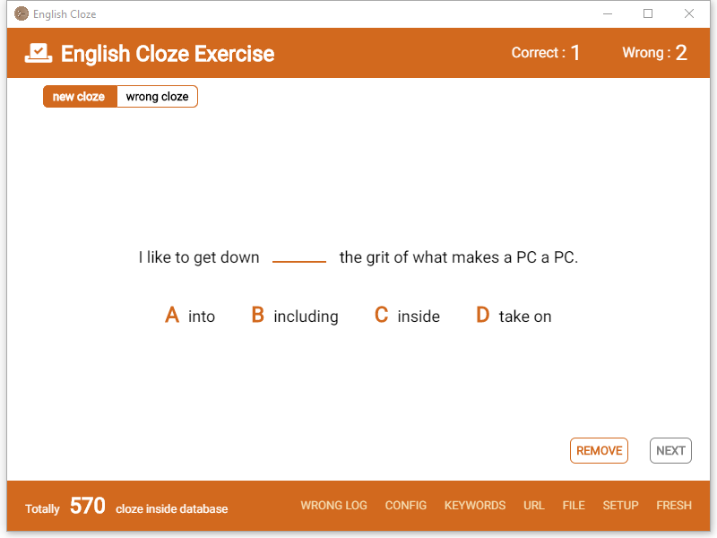
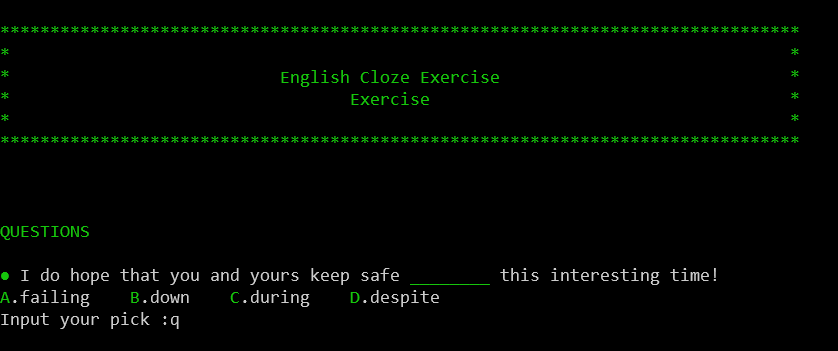

# English Cloze Exercise



## Introduction

Cloze is common in almost every sort of English examination and it should not be eaxggerating to say that cloze company with me in my entire studenthood. Amongst other things, the origin of cloze get my attention. On Internet, Rss , blogs and etc, all could be the origin where cloze come from, and we shall have endless clozes. It is on this ground that this small software is written.

This software will grab contents from RSS source and Medium Blog as well as local text file, and explode them into sentences. Next, it will filter these sentences by standards like longer than 10 words and shorter than 20 words, etc. After flitration, it will seek for key words which are the words we want to exercise their usage in these sentences. Once a keyword is found in the sentence, it will replaced by a gap, and three other words will be offered on their similarity to the key word as options. Such, a compelete cloze is composed.

This is how it works.

In the menu

* FRESH : Fetch new clozes from all source to refresh the pool of clozes.
* SETUP : Rebuild database structure and run fresh after that.
* FILE : This will open a folder using explorer, text files in this folder will be taken as local source of clozes.
* URL : This will open a source list file in which all Internet souce this software will read is written line by line. The first one is [keywords] block and urls in this block will be fetched to fill keywords pool. The url must return a json array. You can left empty if you want to use your own keywords. [global-rss] is the RSS source that will be fetched to users outside mainland China. Due to some reason these source might not be available inside mainland China, [china-rss] is the way to work aroud in which china-availbale source should be wirtten. This tool will decide which block will be used base on your ip. [medium] block include the medium article you want to include, and it could be an author's id like @pbennett101 or the link of a specific article. This block will not be read if your ip location is in Mainland China.
* KEYWORDS: This is where you can offer your own key words. They will be added to key  words pool. If you does not written key words url in source url list, these word will be your sole source of key words.
* CONFIG : This is the file offering basic configuration like where data file will be saved. Strongly recommend __DONOT__ modify it unless you know what you are doing.
* WRONG LOG : This is a log file, and whenever your answer is wrong, the cloze will be recorded in this file.

As to other parts, I think the interface will explain itself well.

 

Another option is to use CLI interface program which is much smaller. You can downlaod it [here](https://github.com/jiwenyoung/English-Cloze-Exercise/releases/download/Initial/english-cloze-cli-Linux-x64.tar.xz) for Linux and [here](https://github.com/jiwenyoung/English-Cloze-Exercise/releases/download/Initial/english-cloze-cli-win32-x64.rar) for Windows.

Here are the commands you should know:
```bash 
   cloze setup
```
This command is used to build necessary tables in database.
```bash
    cloze fresh
```
This command is used to fetch new clozes from all sources.
```bash
    cloze exercise
```
This command is used to do your cloze exercise. If you want to exit the program, enter __q__, and if you want to remove this cloze, enter __r__
```bash
    cloze mistake
```
This command is used to do the clozes you had done wrong.
```bash
    cloze keywords
```
This command is used to add/remove/list key words in pool. After entered it, you will come to a interface where three command can be used:
* __add__  add new key word
* __remove__ remove existed key word in pool
* __list__ list all key words in pool
```bash
    cloze server
```
This will startup a server and you can get the clozes by HTTP request. You are free to make own client.
```
GET http://localhost:9000/rollout
```
Get a new cloze from database.
```
GET http://localhost:9000/evaluate?answer=<your picked word>
```
This will return if your pick is right and do corresponding operation, that is, if right, remove it from database, and if wrong, record it to log file
